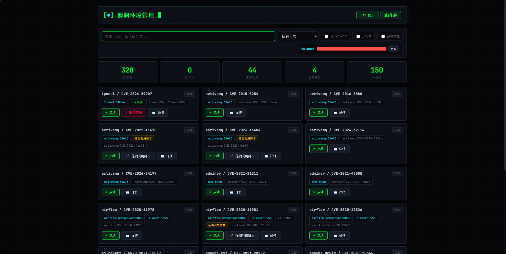

# MyVulHub

Docker 漏洞环境管理平台 — 基于 Flask，提供 Vulhub 环境的一键部署、状态监控与镜像管理。



## 功能

- 环境扫描与分类展示（CVE / 端口 / 状态）
- 一键启停 Docker Compose 环境
- 镜像管理（检测 / 拉取 / 删除）
- Git 同步 Vulhub 仓库（HTTPS / SSH / GitHub CLI）
- 漏洞利用脚本查看、README 文档渲染
- 24h 持久化缓存 + Docker 状态实时同步

## 快速开始

```bash
git clone https://github.com/vulhub/vulhub.git /opt/vulhub
git clone <本项目地址>
cd myVulhub
pip install -r requirements.txt

# 指定 vulhub 路径并启动
VULHUB_PATH=/opt/vulhub python run.py
```

访问 `http://localhost:5000`

生产部署：`sudo ./deploy.sh`（自动创建 systemd 服务）

## 系统要求

| 组件 | 版本 |
|------|------|
| Python | 3.7+ |
| Docker | 20.10+ |
| Docker Compose | 1.x / 2.x |
| Git | 2.0+（可选） |

## 项目结构

```
myVulhub/
├── run.py                 # 入口
├── app/
│   ├── __init__.py        # Flask 工厂
│   ├── config.py          # 配置常量
│   ├── routes/            # 路由层（api.py + main.py）
│   ├── services/          # 服务层（docker.py / git.py / scanner.py）
│   └── utils/             # 工具层（cache.py / compose.py / helpers.py）
├── templates/index.html
├── static/                # 前端资源（CSS / JS / 图片）
├── deploy.sh              # 部署脚本
└── uninstall.sh           # 卸载脚本
```

## 版本历史

### V1.0.2 

稳定性与安全加固。

**修复：**
- 资源泄漏：SSE 流中断时子进程僵尸化（`finally` 终守卫）
- 异常安全：`wait_ready` 非法参数导致 500、`CalledProcessError` 解码崩溃
- 缓存一致性：启停操作后持久化缓存未更新、容器状态同步遗漏
- 死代码消除：移除未使用的装饰器分支、无效配置注入

**优化：**
- 容器名匹配算法精确化（`startswith` 替代前缀集合）
- `docker ps` 短期缓存（2s）避免重复调用
- `get_vulhub_path()` 内存缓存避免重复磁盘 IO
- 并发端口探测替代串行（`wait_ready`）
- 线程池上限从 4 提升至 `min(8, cpu_count)`

**UI：**
- 黑客暗色主题（纯黑底 / neon 绿 / 等宽字体 / 扫描线）
- 前端 JS 模块化拆分（4 文件替代 1429 行单体）
- CSS 统一迁移至 `style.css`，消除内联样式

### V1.0.1 

项目重构与功能补全。

**重构：**
- 拆分为路由层 / 服务层 / 工具层三层架构
- Flask 应用工厂模式（`create_app()`）+ Blueprint
- 服务间通过 `current_app.config` 注入，消除循环导入

**修复：**
- 静态文件模板路径问题
- 部署脚本与卸载脚本逻辑错误
- API 调用参数与响应格式不一致
- Git 同步 dubious ownership 自动处理

**新增：**
- 持久化缓存（24h TTL + 目录哈希自动失效）
- 漏洞利用脚本查看器
- README 中文优先渲染
- 代理拉取镜像支持（proxychains4）

### V1.0.0 

初始版本。

- Vulhub 环境扫描与分类
- Docker Compose 一键启停
- 镜像检测与流式拉取（SSE）
- Git 仓库同步（HTTPS / SSH）
- Web UI 环境管理界面

## 许可证

MIT License
